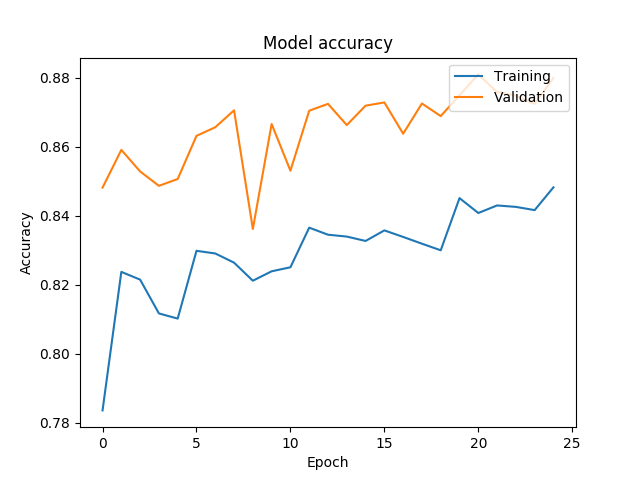
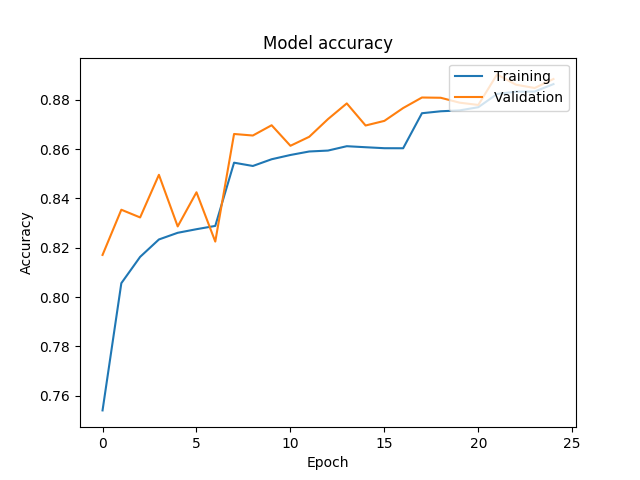
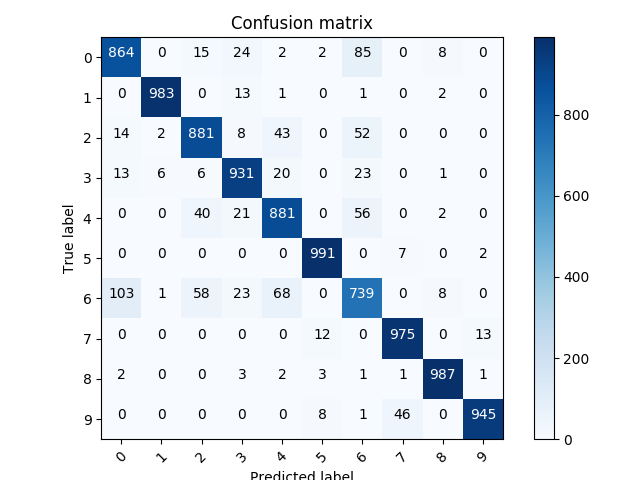
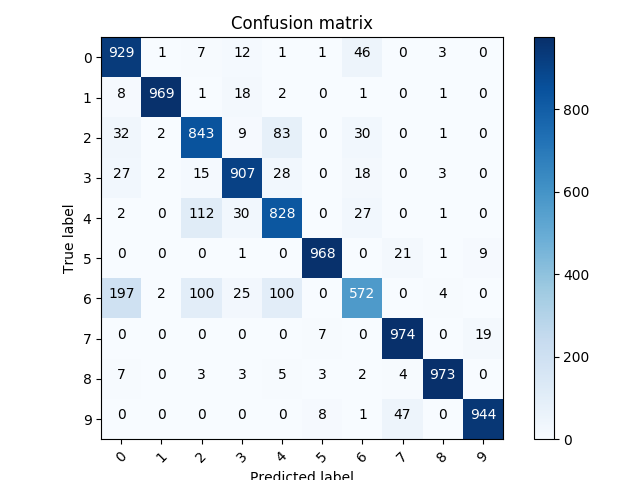

  [![Contributors][contributors-shield]][contributors-url] [![Forks][forks-shield]][forks-url] [![Stargazers][stars-shield]][stars-url] [![Issues][issues-shield]][issues-url] [![MIT License][license-shield]][license-url] [![LinkedIn][linkedin-shield]][linkedin-url]

<!-- PROJECT LOGO -->
<br />

<p align="center">
  <a href="https://github.com/vineeths96/FashionMNIST">
    
  </a>
  <h3 align="center">FashionMNIST</h3>
  <p align="center">
    Catergorical classification with DNN and CNN.
    <br />
    <a href=https://github.com/vineeths96/FashionMNIST><strong>Explore the repository»</strong></a>
    <br />
    <br />
    <a href=https://github.com/vineeths96/FashionMNIST/blob/master/results/Project2.pdf>View Problem Statement</a>
    <a href=https://github.com/vineeths96/FashionMNIST/blob/master/results/Deep_Learning_Report_2.pdf>View Report</a>
  </p>


</p>

> tags : classification, categorization, fashionmnist, dnn, cnn, deep learning, tensorflow


<!-- ABOUT THE PROJECT -->
## About The Project

This project is an implementation of the task of Fashion MNIST classification using the popular [FashionMNIST](https://github.com/zalandoresearch/fashion-mnist) dataset comprising of Zalando’s article images. We are required to identify an image and classify it to one of the ten available categories. The following models were implemented and the performance was evaluated. 

* Multi-layer Neural Network
* Convolutional Neural Network

### Built With
This project was built with 

* python v3.7
* tensorflow v2.1
* The list of libraries used for developing this project is available at [requirements.txt](requirements.txt).


<!-- GETTING STARTED -->

## Getting Started

Clone the repository into a local machine using

```shell
git clone https://github.com/vineeths96/FashionMNIST
```

### Prerequisites

Please install required libraries by running the following command (preferably within a virtual environment).

```shell
pip install -r requirements.txt
```

We will load the Fashion MNIST using Tensorflow API. Hence no manual setup is necessary for the program.

### Instructions to run

The `main.py` is the interface to the program. It is programmed to run in two modes – train mode and test mode. The `main.py` file takes an optional command line argument to specify the mode of execution – whether to train or test model. The `main.py`, when executed without any arguments, enters into testing the deep models, and produces the output files `multi-layer-net.txt` and `convolution-neural-net.txt`. The `main.py` when executed with the (optional argument) `--train-model` enters into training mode and saves the models after training. 

##### Train mode

```shell
python main.py --train-model 
```

##### Test mode

```shell
python main.py
```


<!-- RESULTS -->

## Results

Detailed discussions on results can be found in the report [here](./Deep_Learning_Report_2.pdf)

|                     CNN                     |                     MLNN                     |
| :-----------------------------------------: | :------------------------------------------: |
|  |  |
|   |   |
|            Test Accuracy: 91.76%            |            Test Accuracy: 89.06%             |
|                                            


<!-- LICENSE -->

## License

Distributed under the MIT License. See `LICENSE` for more information.


<!-- CONTACT -->
## Contact

Vineeth S - vs96codes@gmail.com

Project Link: [https://github.com/vineeths96/FashionMNIST](https://github.com/vineeths96/FashionMNIST)


<!-- ACKNOWLEDGEMENTS -->
## Acknowledgements

* Fashion-MNIST

  >Fashion-MNIST: a Novel Image Dataset for Benchmarking Machine Learning Algorithms. Han Xiao, Kashif Rasul, Roland Vollgraf. [arXiv:1708.07747](http://arxiv.org/abs/1708.07747)


<!-- MARKDOWN LINKS & IMAGES -->
<!-- https://www.markdownguide.org/basic-syntax/#reference-style-links -->

[contributors-shield]: https://img.shields.io/github/contributors/vineeths96/FashionMNIST.svg?style=flat-square
[contributors-url]: https://github.com/vineeths96/FashionMNIST/graphs/contributors
[forks-shield]: https://img.shields.io/github/forks/vineeths96/FashionMNIST.svg?style=flat-square
[forks-url]: https://github.com/vineeths96/FashionMNIST/network/members
[stars-shield]: https://img.shields.io/github/stars/vineeths96/FashionMNIST.svg?style=flat-square
[stars-url]: https://github.com/vineeths96/FashionMNIST/stargazers
[issues-shield]: https://img.shields.io/github/issues/vineeths96/FashionMNIST.svg?style=flat-square
[issues-url]: https://github.com/vineeths96/FashionMNIST/issues
[license-shield]: https://img.shields.io/badge/License-MIT-yellow.svg
[license-url]: https://github.com/vineeths96/FashionMNIST/blob/master/LICENSE
[linkedin-shield]: https://img.shields.io/badge/-LinkedIn-black.svg?style=flat-square&logo=linkedin&colorB=555
[linkedin-url]: https://linkedin.com/in/vineeths

